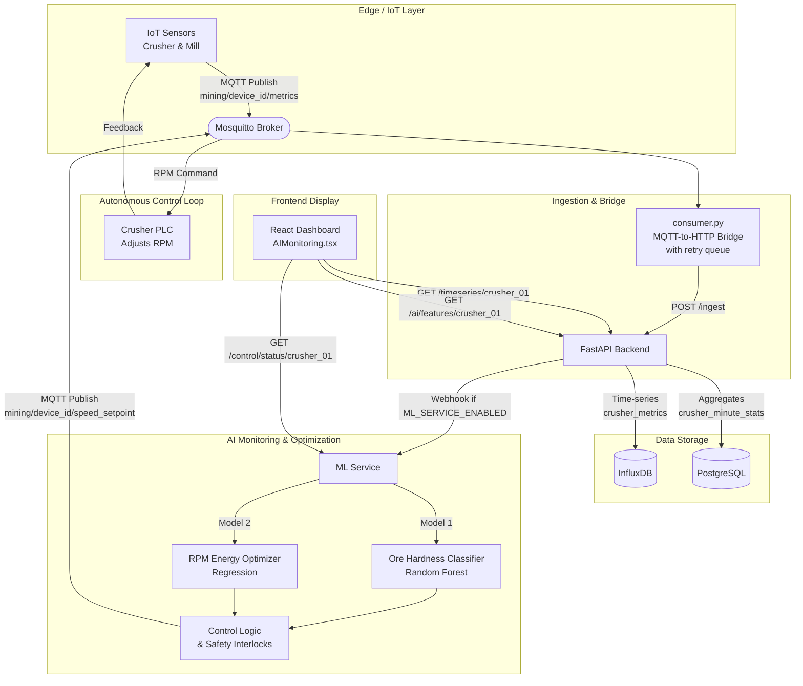

# Mine Sarthi — The Charioteer of Sustainable Mining

<p align="center">
  
  
  
  
  
  
  
  
</p>

> **Mine Sarthi** is an AI-powered, full-stack platform that optimizes energy usage in iron ore mining operations. It uses real-time machine learning to automatically adjust crusher speed (RPM) based on ore hardness, cutting energy consumption while maintaining production throughput. With end-to-end IoT integration, predictive control, and safety interlocks, Mine Sarthi shows how technology can make mining more sustainable and cost-effective.

<p align="center">
  
</p>

---

## 📋 Table of Contents
- [Problem Statement](#-problem-statement)
- [Overview](#-overview)
- [How It Works — The Core Idea](#-how-it-works--the-core-idea)
- [System Architecture](#️-system-architecture)
- [Data Flow — Step by Step](#-data-flow--step-by-step)
- [Component Deep Dive](#-component-deep-dive)
- [AI Models Explained](#-ai-models-explained)
- [Tech Stack](#-tech-stack)
- [Project Structure](#-project-structure)
- [Getting Started](#-getting-started)
  - [Prerequisites](#prerequisites)
  - [Quick Start (One Command)](#quick-start-one-command)
  - [Manual Start (Step by Step)](#manual-start-step-by-step)
  - [Configuration](#configuration)
- [API Reference](#-api-reference)
- [Verifying It Works](#-verifying-it-works)
- [Key Features](#-key-features)
- [Troubleshooting](#-troubleshooting)
- [Contributing](#-contributing)
- [Team](#-team)
- [Author](#-author)
- [License](#-license)

---

## 🎯 Problem Statement

### SIH Problem Statement ID: **25210**
**Problem Statement Title:** Efficient Energy use in Iron Ore Mining Operations
**Theme:** Miscellaneous | **PS Category:** Software | **Team ID:** 97177 | **Team Name:** @XEN!TH

---

#### Background
In mining operations, the processes of **crushing and grinding** — collectively known as **comminution** — are essential for liberating valuable minerals from the surrounding rock. However, these processes are among the **most energy-intensive stages** in mineral processing, often accounting for up to **50% of a mine's total energy consumption**. These inefficiencies drive up **operational costs** and significantly increase the **environmental footprint** of mining.

#### Description
Traditional crushing and grinding equipment often operate under **suboptimal conditions** because of static control systems, wear and tear, and a lack of real-time adaptability. This results in:
- ⚠️ **Excessive energy usage** — machines run at fixed speeds regardless of the material being processed
- 📉 **Reduced throughput** — speed is not matched to feed conditions
- 💰 **Increased maintenance costs** — reactive rather than predictive maintenance
- 🌍 **Higher carbon emissions** — wasted energy translates directly into a larger carbon footprint

#### Expected Solutions
**AI-Controlled Optimization Systems:**
1. **Real-Time Monitoring & Control:** AI-driven systems that continuously monitor variables such as ore hardness, feed size, moisture content, and equipment load.
2. **Predictive Maintenance:** ML models that predict wear patterns and schedule maintenance proactively, reducing downtime and energy waste.
3. **Dynamic Process Adjustment:** Algorithms that adjust operational parameters (crusher speed, grinding media size, mill rotation speed) in real time.
4. **Integration with IoT Sensors:** Smart sensors that collect high-resolution data and feed it into AI models for accurate decision-making.

> **Main Goal:** Optimize energy consumption in the crushing plant.

---

## 🧾 Overview

**Mine Sarthi** is a full-stack platform that directly addresses SIH PS 25210. It closes the loop between **sensing**, **thinking**, and **acting**:

| Pillar | What it does |
|:---|:---|
| ✅ **Real-Time Monitoring** | IoT sensors continuously stream 9+ operational parameters (power, RPM, feed rate, feed size, temperature, vibration, motor current, ore fines %, hardness index). |
| ✅ **AI-Driven Optimization** | Two ML models run in sequence — one classifies ore hardness, the second recommends the most energy-efficient crusher speed. |
| ✅ **Autonomous Control** | An MQTT-based closed-loop control service adjusts crusher RPM automatically, guarded by safety interlocks. |
| ✅ **Energy Savings** | Targets a measurable reduction in `kWh/ton` versus static baseline operation. |
| ✅ **Complete Stack** | Data pipeline (MQTT → InfluxDB → PostgreSQL), ML service (FastAPI + Scikit-learn), and a modern React dashboard. |

---

## 💡 How It Works — The Core Idea

The intuition is simple but powerful:

> **Different ores need different crusher speeds. Running a crusher at full speed on soft ore wastes energy; running too slow on hard ore loses throughput. Mine Sarthi continuously matches speed to material.**

1. **Sensors** on the crusher report live conditions (power draw, feed size, vibration, etc.).
2. **Model 1** looks at those readings and decides: *is this ore SOFT, MEDIUM, or HARD?*
3. **Model 2** takes the ore type plus live feed data and calculates the **optimal RPM** that minimizes energy consumed per ton.
4. **Control logic** checks safety limits, then sends the new speed setpoint back to the crusher over MQTT — automatically and continuously.
5. **The dashboard** shows operators everything in real time: live sensor data, the AI's decisions, and the resulting energy savings.

This is a textbook **cyber-physical closed-loop system**: sense → infer → decide → actuate → feedback.

---

## 🏗️ System Architecture

> *High-level architecture showing the complete data flow — from IoT sensors through MQTT ingestion, real-time AI inference, to autonomous speed control commands.*

### 🔄 Architecture Flow


**MQTT Topics:**

| Topic | Direction | Purpose |
|:---|:---|:---|
| `mining/{device_id}/metrics` | IoT → Broker | Sensor telemetry |
| `mining/{device_id}/speed_setpoint` | ML Service → Broker | RPM commands to crusher |

---

## 🔁 Data Flow — Step by Step

Here is exactly what happens to a single sensor reading as it travels through the system:

1. **Publish** — `publisher_mqtt.py` (the simulated IoT gateway) builds a JSON telemetry payload and publishes it to `mining/crusher_01/metrics` on the Mosquitto broker every 2–3 seconds.
2. **Bridge** — `consumer.py` is subscribed to `mining/+/metrics`. It receives the message, validates it, and forwards it via HTTP `POST /ingest` to the FastAPI backend. If the backend is temporarily down, messages are queued (up to 1000) and retried with exponential backoff.
3. **Ingest & Store** — FastAPI writes the raw reading to **InfluxDB** (`crusher_metrics` measurement) and periodically rolls it up into per-minute aggregates in **PostgreSQL**.
4. **Infer** — When enabled, FastAPI calls the **ML Service** webhook. Model 1 classifies ore hardness; Model 2 computes the optimal RPM; the result is cached and stored.
5. **Decide & Act** — The `SpeedControlService` checks the recommendation against **safety interlocks** (RPM range, power, vibration, temperature). If safe and automatic control is enabled, it publishes a new `speed_setpoint` back over MQTT.
6. **Visualize** — The React dashboard polls the backend and ML service every few seconds, showing live sensor values, AI predictions, control status, and energy savings.

---

## 🧩 Component Deep Dive

| Component | Location | Role | Technology |
|:---|:---|:---|:---|
| **IoT Publisher** | `data pipeline/gateway/publisher_mqtt.py` | Simulates crusher sensors and publishes telemetry to MQTT. In production this is replaced by real sensors on the same topic. | Paho-MQTT |
| **MQTT Broker** | Docker: `mosquitto` | Relays all MQTT messages between publishers and subscribers. | Eclipse Mosquitto 2.0 |
| **Bridge** | `data pipeline/bridge/consumer.py` | Resilient MQTT → HTTP bridge with validation, retry queue, and health checks. | Python, Requests |
| **FastAPI Backend** | `data pipeline/backend/fastapi_app.py` | Ingests telemetry, writes to InfluxDB + PostgreSQL, exposes query APIs, and triggers the ML webhook. | FastAPI, Pydantic |
| **InfluxDB** | Docker | High-frequency time-series storage (`crusher_metrics`). | InfluxDB 1.8 |
| **PostgreSQL** | Docker | Minute-level aggregates (`crusher_minute_stats`, `sensor_minute_agg`). | PostgreSQL 15 |
| **ML Service** | `ml_service/` | Hosts Model 1 & Model 2, the closed-loop control service, safety interlocks, and MQTT command publishing. | Scikit-learn, FastAPI |
| **Frontend** | `smart-ore-flow-main/` | Real-time dashboard: AI Monitoring, Digital Twin, Energy Usage, Hardware/M2M, and more. | React, Vite, Tailwind |

---

## 🤖 AI Models Explained

The heart of Mine Sarthi is a **two-stage sequential ML pipeline**. The output of the first model becomes an input to the second.

### Model 1 — Ore Hardness Classifier
- **Algorithm:** Random Forest Classifier
- **Job:** Look at live sensor data and classify the ore currently being crushed.
- **Inputs:** Power (kW), feed rate (TPH), feed size (mm) *(plus additional telemetry available for extended versions)*
- **Output:** Ore class — **SOFT / MEDIUM / HARD** — with a confidence percentage.
- **Why it matters:** Ore hardness is the single biggest driver of how much energy crushing requires. Knowing it in real time lets the system adapt instead of guessing.

### Model 2 — RPM Energy Optimizer
- **Algorithm:** Regression model combined with numerical optimization (`scipy.optimize`).
- **Job:** Given the ore type from Model 1 and live feed conditions, find the crusher speed that minimizes energy per ton.
- **Inputs:** Predicted ore type + feed rate + feed size + closed-side setting (CSS).
- **Output:** **Optimal RPM setpoint**, predicted `kWh/ton`, and estimated energy savings %.
- **Why it matters:** This is where the actual savings come from — the model turns "what is this ore?" into "how fast should we run?".

### How they work together
```
Live sensors ─▶ Model 1 (classify ore) ─▶ ore type + confidence
                                            │
                                            ▼
                           Model 2 (optimize) ─▶ best RPM ─▶ safety check ─▶ crusher
```

---

## 🧰 Tech Stack

| Category | Technology |
|:---|:---|
| **Backend** | Python 3.10+, FastAPI, Uvicorn |
| **Machine Learning** | Scikit-learn (Random Forest, Regression), NumPy, SciPy |
| **IoT / Messaging** | MQTT (Eclipse Mosquitto), Paho-MQTT |
| **Databases** | InfluxDB 1.8 (time-series), PostgreSQL 15 (relational) |
| **Frontend** | React 18, TypeScript, Vite, Tailwind CSS, shadcn/ui, Recharts, Three.js |
| **DevOps** | Docker, Docker Compose, PowerShell automation scripts |
| **Others** | Pydantic, python-dotenv, Requests, Asyncio |

---

## 📁 Project Structure

```bash
Mine-Sarthi/
├── data pipeline/            # Core ingestion & infrastructure
│   ├── backend/              # FastAPI ingestion server (fastapi_app.py)
│   ├── bridge/               # MQTT -> HTTP bridge (resilient, consumer.py)
│   ├── gateway/              # IoT publisher (publisher_mqtt.py)
│   ├── mqtt_broker/          # Mosquitto configuration
│   ├── postgres/             # PostgreSQL init.sql schema
│   ├── .env                  # Environment configuration
│   ├── requirements.txt      # Backend Python dependencies
│   └── docker-compose.yml    # Orchestrates Mosquitto, InfluxDB, PostgreSQL, ML service
├── ml_service/               # AI Engine (Inference & Control)
│   ├── api/                  # Prediction, control, safety & monitoring endpoints
│   ├── models/               # Trained .pkl models (Model 1 & Model 2)
│   ├── src/                  # SpeedControlService, safety interlocks, MQTT publisher
│   ├── static/               # Built-in ML dashboard
│   ├── requirements.txt      # ML service Python dependencies
│   └── Dockerfile            # ML service container build
├── smart-ore-flow-main/      # Frontend React application
│   └── smart-ore-flow-main/  # (inner app directory: src/, package.json, vite.config.ts)
├── images/                   # Project documentation images
├── start-all.ps1             # One-command startup for the whole stack (Windows)
├── stop-all.ps1              # One-command shutdown for the whole stack (Windows)
└── README.md                 # You are here
```

---

## 🚀 Getting Started

### Prerequisites
- **Docker Desktop** (with Docker Compose) — for Mosquitto, InfluxDB, PostgreSQL, and the ML service
- **Python 3.10+** — for the backend, bridge, and IoT publisher
- **Node.js 18+** — for the React frontend

### Quick Start (One Command)

On **Windows (PowerShell)**, two helper scripts are included at the project root.

**First run** (installs Python + npm dependencies, then launches everything):
```powershell
.\start-all.ps1 -Setup
```

**Every run after that:**
```powershell
.\start-all.ps1
```

This will:
1. Start the Docker infrastructure (Mosquitto `1883`, InfluxDB `8086`, PostgreSQL `5432`, ML service `8001`).
2. Launch the FastAPI backend (`8000`), the MQTT bridge, the IoT publisher, and the React frontend (`8080`) — each in its own labeled window.

**Stop everything:**
```powershell
.\stop-all.ps1
```

> If PowerShell blocks the script, run this once (safe, user-scoped):
> `Set-ExecutionPolicy -Scope CurrentUser -ExecutionPolicy RemoteSigned`

### Manual Start (Step by Step)

If you prefer to run each service yourself, use **separate terminals**:

**1. Infrastructure (Docker):**
```bash
cd "data pipeline"
docker compose up -d --build
```

**2. FastAPI backend (port 8000):**
```bash
cd "data pipeline/backend"
python -m venv ../.venv            # first time only
../.venv/Scripts/pip install -r ../requirements.txt   # first time only
../.venv/Scripts/python -m uvicorn fastapi_app:app --host 0.0.0.0 --port 8000
```

**3. MQTT bridge:**
```bash
cd "data pipeline/bridge"
../.venv/Scripts/python consumer.py
```

**4. IoT publisher:**
```bash
cd "data pipeline/gateway"
../.venv/Scripts/python publisher_mqtt.py --device crusher_01
```

**5. React frontend (port 8080):**
```bash
cd smart-ore-flow-main/smart-ore-flow-main
npm install --legacy-peer-deps      # first time only
npm run dev
```

Then open **http://localhost:8080** and log in with the demo credentials:
`admin@mine.com` / `password123`

### Configuration

Backend configuration lives in `data pipeline/.env`. Key values:

| Variable | Purpose | Default |
|:---|:---|:---|
| `MQTT_HOST` / `MQTT_PORT` | MQTT broker address | `localhost:1883` |
| `INFLUX_HOST` / `INFLUX_PORT` / `INFLUX_DB` | InfluxDB connection | `localhost:8086`, `mine_sarthi_realtime` |
| `PG_HOST` / `PG_PORT` / `PG_DB` / `PG_USER` / `PG_PASSWORD` | PostgreSQL connection | `localhost:5432`, `mine_sarthi`, `postgres`, `password` |
| `BACKEND_URL` | Where the bridge forwards telemetry | `http://localhost:8000/ingest` |
| `MQTT_TOPIC_PATTERN` | Topics the bridge subscribes to | `mining/+/metrics` |

> **Note:** The PostgreSQL credentials in `.env` must match those in `docker-compose.yml` (`mine_sarthi` / `postgres` / `password`).

---

## 📡 API Reference

### FastAPI Backend (`:8000`)
| Method | Endpoint | Purpose |
|:---|:---|:---|
| `POST` | `/ingest` | Ingest telemetry (single object or array) |
| `GET` | `/health` | Service + database health |
| `GET` | `/devices` | List known devices |
| `GET` | `/timeseries/{device_id}` | Raw time-series from InfluxDB |
| `GET` | `/ai/features/{device_id}` | Aggregated features + ML predictions |
| `GET` | `/dashboard/energy_summary/{device_id}` | Energy totals from PostgreSQL |
| `POST` | `/commands/publish` | Publish an RPM command to MQTT |

### ML Service (`:8001`)
| Method | Endpoint | Purpose |
|:---|:---|:---|
| `GET` | `/health` | Service + model load status |
| `POST` | `/api/v1/predict` | End-to-end prediction (Model 1 → Model 2) |
| `POST` | `/api/v1/classify-ore` | Model 1 only |
| `POST` | `/api/v1/recommend-rpm` | Model 2 only |
| `POST` | `/api/v1/control/start` | Start the autonomous speed-control loop |
| `GET` | `/api/v1/control/status/{device_id}` | Control loop status & last decision |
| `GET` | `/dashboard` | Built-in ML dashboard |

---

## ✅ Verifying It Works

Once everything is running, these checks confirm the full pipeline is healthy:

```bash
curl http://localhost:8000/health                       # backend: influx + pg connected
curl http://localhost:8001/health                       # ML: models_loaded = true
curl "http://localhost:8000/timeseries/crusher_01?limit=1"   # live sensor reading
curl http://localhost:8000/ai/features/crusher_01        # live AI prediction
curl http://localhost:8080                               # frontend returns 200
```

A healthy `/ai/features/crusher_01` response looks like:
```json
{
  "device_id": "crusher_01",
  "ore_hardness_prediction": "Soft",
  "ore_hardness_confidence": 1.0,
  "optimal_rpm_recommendation": 1047.2,
  "predicted_energy_kwh_per_t": 1.045,
  "energy_savings_pct": 0.0
}
```

The best page to see it all live is **http://localhost:8080/ai-monitoring**.

---

## ✨ Key Features
- ⚡ **Real-time Speed Control** — Autonomous adjustment of crusher RPM via AI, guarded by safety interlocks.
- 🧠 **Sequential AI Pipeline** — Ore classification feeds directly into energy optimization.
- 🔄 **Digital Twin** — Visual process-flow simulation for operational planning.
- 📊 **Energy Usage Analytics** — Granular breakdown of consumption by equipment.
- 🖥️ **Hardware / M2M View** — Live device status, signal strength, and network health.
- ☀️ **Renewable Integration** — Dashboard for solar and battery storage management.
- 🛡️ **Safety Interlocks** — RPM, power, vibration, and temperature limits with emergency-stop logic.
- 🐳 **Fully Containerized Infra** — Reproducible environment via Docker Compose.

---

## 🧯 Troubleshooting

| Symptom | Cause | Fix |
|:---|:---|:---|
| Frontend `npm install` fails with peer-dependency error | React 18 vs a package requesting React 19 | Use `npm install --legacy-peer-deps` |
| Backend `/health` shows `pg_status: disconnected` | `.env` credentials don't match Docker | Set `PG_DB=mine_sarthi`, `PG_USER=postgres`, `PG_PASSWORD=password` |
| ML service `/health` shows `models_loaded: false` | Model `.pkl` files not mounted | Ensure `ml_service/models/` is present and mounted in `docker-compose.yml` |
| No data on the dashboard | Publisher or bridge not running | Confirm the IoT publisher and bridge terminals are active |
| `docker compose` warns about `version` attribute | Obsolete Compose key | Harmless; can be ignored |

---

## 🤝 Contributing
Contributions to make mining more sustainable are welcome!

1. Fork the Project
2. Create your Feature Branch (`git checkout -b feature/AmazingFeature`)
3. Commit your Changes (`git commit -m 'Add some AmazingFeature'`)
4. Push to the Branch (`git push origin feature/AmazingFeature`)
5. Open a Pull Request

---

## 👥 Team — @XEN!TH
- **[Aditya Goyal](https://github.com/Adityagoyal804)**
- **[Shivani Sharma](https://github.com/shivxnii)** — Team Lead
- **[Akshat Kumar Arya](https://github.com/Akshat-D-Arya)**
- **Himanshi Bishoi**
- **Aditya Naruka**

---

## 👤 Author
**Aditya Goyal** — SIH'25 Finalist | Web & DBMS Projects | AI & Telecom Systems enthusiast

- GitHub: [@Adityagoyal804](https://github.com/Adityagoyal804)
- LinkedIn: [aditya-goyal-2a12962b4](https://www.linkedin.com/in/aditya-goyal-2a12962b4)

---

## 📄 License
Distributed under the MIT License. See [`LICENSE`](LICENSE) for more information.

---

Made with ❤️ for **Smart India Hackathon 2025** by Team **@XEN!TH**
